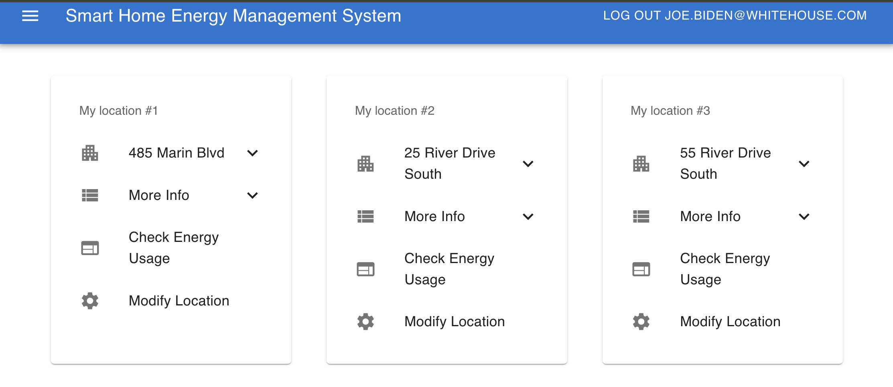

# Front-End Implementation

## Packages
&nbsp;&nbsp;&nbsp;&nbsp; This project utilized React+Type Script to implement all front-end pages. The basic components (table, list, etc.) are customized from MUI Libraries. And the charts(Bar, Pie, Line Charts) are drawn with Recharts API.  

## Connection with Server
&nbsp;&nbsp;&nbsp;&nbsp; All of the user inputs and request are gathered at the front end pages, and sent to a localhost port running the server by Axios. The logic of such process are described as follows:  
1. Gather user input
User input includes form values, button clicking events, date range selection, etc. These information are all gathered by the components of front-end.  
2. Sending request to server  
After getting the user input, the corresponding component sends http request to the server:
```js
await addLocation(postData, token, email)
        .then((res) => {
          setSuccessSnackbar(true);
          window.location.href = "/location";
        })
        .catch((error) => {
          setFailSnackbar(true);
          setErrorInfo(error.data);
        });
```
The request functions are all implemented in the folder 'src/services', providing a good practice of seperating functional procedures and GUI component:
```js
export const addLocation = async (data: AddLocationData, token: string, email:string) => {
  const params = {
    // handling params
  }
  const config = {
    headers: {
      'Authorization': `Bearer ${token}`
    }
  };
  return axiosInstance.post(`${constants.ENDPOINT_LOCATION_URL}/add`, params, config);
}
```
3. Handling request and response with Axios
The Axios libraries are used to hanlde request and response across the front-end and the back-end, the detailed implementation can be seen in the source code: 'src/services/axiosConfig.ts'
```js
axiosInstance.interceptors.request.use(
    config => {
        const token = sessionStorage.getItem('token');
        // ... handling request
    }
);

axiosInstance.interceptors.response.use(
    response => response,
    error => {
        if (error.response.status === 401 || error.response.status === 403) {
            // clear token
            sessionStorage.clear();
            const path = window.location.pathname;
            // ... handling response
        }
    }
);

export default axiosInstance;
```

## Pages Implementation
### Components Based Page Design
&nbsp;&nbsp;&nbsp;&nbsp;The implementation of the the website centers around building a collection of independent, reusable modules. This design approach promotes reusability and composability, allowing components like charts, date pickers, and form controls to be used across various parts of the application. For example, the MyLocationPage is composed of a list of components named 'LocationCard', each location card displays one location with its detailed information, and handle the jump to its energy usage pages. 


### State Management
&nbsp;&nbsp;&nbsp;&nbsp;Thes page initialize and manage various states (like energyLocationDay, displayLocation, locations, displayData, etc.) to keep track of the data and user selections.
They fetche data from external services or APIs (getCustomerEnergyPerLocationPerDay, getCustomerLocation) to populate these states. This is done in useEffect hooks to ensure that data fetching is triggered at appropriate times, such as on component mount or when dependencies change: