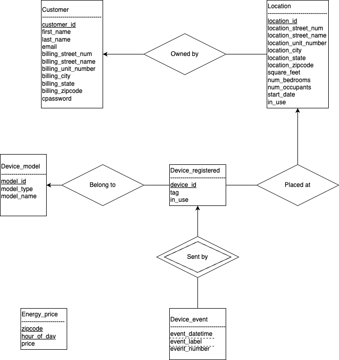
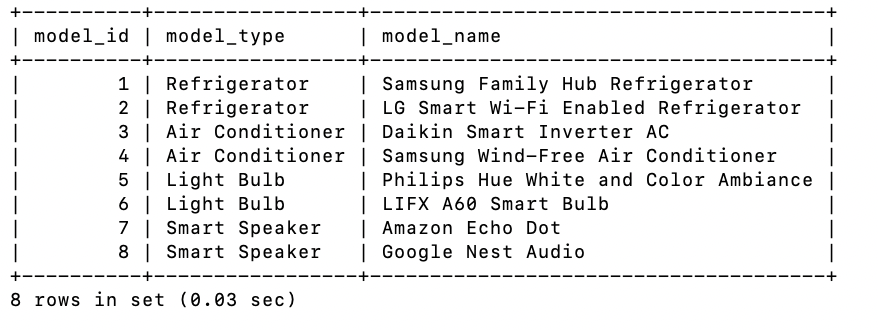
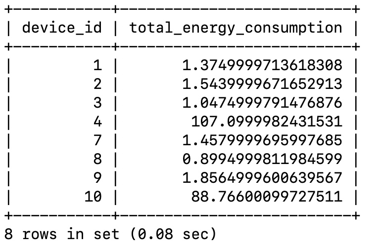

# 1 Introduction

&nbsp;&nbsp;&nbsp;&nbsp;In this project, we will need to design a web-based Smart Home Energy Management System. The project consists of two parts: database design and system implementation. In this part, we will describe a comprehensive database design. The organization of this part is as follows: In [Section 2](#2-schema-design), we will conduct a needs analysis for the project, followed by table design, as well as assumptions and justifications for the design. [Section 3](#3-database-creation) introduces the detailed creation of the database schema, specifying each table's columns, data types, and constraints. Finally, we will include some testing samples of the schema in [Section 4](#4-sql). 

# 2 Schema Design

## 2.1 Need Analysis
Based on the problem description, the information and functionalities needed can be concluded as follows:  
- User System:
  - Sign up: Name, billing address, email
  - One user <- many locations
- Location: 
    - Able to modify locations
    - Attributes:
      - Full address, including unit number
      - Start date
      - Square feet
      - Num bedrooms
      - Number of occupants of the unit
      - List of registered devices
- Devices
  - Type: AC, fridge, ...
  - Model: Samsung AC R100, ...
  - Ownership: User, Locations. (Can have more than one same model in a location by a user)
  - Can have an ID
- Devices Events(Signal / Information)
  - Switching On / Off (Time)
  - Setting Changed (Time, setting[possibly]). e.g. AC temperature, light bulb brightness, fridge door opened / closed, ...
  - Energy consumption
    - info / 5min: energy use
    - switched off: energy use since last update
 - Event format
   - Device ID
   - time stamp
   - label (e.g. energy_consumption, temperature_lowered, door_opened, ...)
   - number (corresponding to label)
- Energy Price
  - Vary according to: 
    - Hour
    - Zip Code

## 2.2 Entity-Relation Design
Based on the need analysis, the Entity-Relation Graph can be drawn:  


## 2.3 Assumptions and Justifications
The ER-Gram is calculated based on some assumptions, some of which will actually affect the schema. Below is an description of all the assumptions made:  

### 2.3.1 User & Location
Assumptions:  
1. Each user can only have one billing address. So billing_address could be an attribute in user table.  
2. Each home location can only belong to one account, so customer_id & start_date should be an attribute in address table.  
3. We assume the location format as the following: (Line 1)street_number street_name (Line 2)unit_number (zip code info)city, state zipcode. Based on the atomic principals, addresses are separated into different columns (e.g. street_num, street_name, ...).  
4. We also asuume the input addresses are all legal(they really exist, and in the right format). 

### 2.3.2 Device & Event
Assumptions:  
1. All the device models are in the list of device_model table, whenever a new device is promoted, we can modify the database to put it into the table.   
2. User can only register devices of which the models are in the device_model table. So there won't be any records in the *device_registered* table with ambiguous model_id.  
3. There are only limited number of event_label, and every the event_label revceived by the system should be legal.  
4. As mentioned in the problem desciption, we don't have to model how the system prestored all the event_labels. So we assume that the events are automatically stored into the database(such process is not modeled). In the project, this process might be simulated by manaully insert data into the model_event table.  
5. We assume that devices could generate two (or more) events at the same timeframe. However, such events will not have a same event_label. For example, when an AC is turened off, it generates two events: 'Off' and 'EnergyReport' with a same timeframe. Consequently, (device_id, event_label, event_datetime) is a candidate key of the *device_event* table.  

### 2.3.3 Energy Price & Calculation
Assumptions:
1. The unit of energy price is *dollars / kwh*. The unit of the energy consumption reported by devices is *kwh*.  
2. Because the energy price might vary between two consecutive hours, there might be situations where one EnergyReport has a time span across tow hours(e.g. first 2 minites in 7 and the other 3 minutes in 8). In this case, we choose the unit price of the second hour for calculation, resulting in an approximate energy price, which would not have significant difference with the actual price, given that the numbers of kwh used by home devices per 5 minutes are very small, and that the unit price of energy would not vary a lot.  


## 2.4 Tables Design
###  2.4.1 User & Location Table

customer: (**customer_id**, first_name, last_name, email, billing_street_num, billing_street_name, billing_unit_number, billing_city, billing_state, billing_zipcode, cpassword, in_use)  
location: (**location_id**, customer_id, location_street_num, location_street_name, location_unit_number, location_city, location_state, location_zipcode, square_feet, num_bedrooms, start_date, num_occupants, in_use)  

###  2.4.2 Device & Event
device_model(**model_id**, model_type, model_name), *This is for prestoring devices for user to register*  
device_registered(**device_id**, model_id, location_id, tag, in_use), *This is for devices registered by user*  
device_event(**device_id**, **event_label**, **event_datetime**, event_number), *event_number corresponds to event_label*  

###  2.4.3 Energy Price
energy_price(**zipcode**, **hour_of_day**, price), *Energy prices vary on hourly and locational basis*   

# 3 Database Creation
*In this part, we choose MySQL to implement the schema.*  

## 3.1 customer  
```sql
CREATE TABLE customer(
    customer_id INT AUTO_INCREMENT,
    first_name VARCHAR(63) NOT NULL,
    last_name VARCHAR(63) NOT NULL,
    email VARCHAR(255) UNIQUE NOT NULL,
    billing_street_num INT NOT NULL,
    billing_street_name VARCHAR(127) NOT NULL,
    billing_unit_number VARCHAR(127) NOT NULL,
    billing_city VARCHAR(127) NOT NULL,
    billing_state VARCHAR(16) NOT NULL, 
    billing_zipcode VARCHAR(5) NOT NULL,
    cpassword VARCHAR(127) NOT NULL,
    in_use BOOLEAN NOT NULL DEFAULT TRUE,
    PRIMARY KEY (customer_id)
);
```
## 3.2 location  
```sql
CREATE TABLE location(
    location_id INT AUTO_INCREMENT,
    customer_id INT NOT NULL,
    location_street_num INT NOT NULL,
    location_street_name VARCHAR(127) NOT NULL,
    location_unit_number VARCHAR(127) NOT NULL,
    location_city VARCHAR(127) NOT NULL,
    location_state VARCHAR(127) NOT NULL,
    location_zipcode VARCHAR(5) NOT NULL,
    square_feet FLOAT NOT NULL,
    num_bedrooms INT NOT NULL,
    num_occupants INT NOT NULL,
    start_date DATETIME NOT NULL,
    in_use BOOLEAN NOT NULL DEFAULT TRUE,
    PRIMARY KEY (location_id),
    FOREIGN KEY (customer_id) REFERENCES customer(customer_id) ON DELETE CASCADE
);
```
## 3.3 device_model  
```sql
CREATE TABLE device_model(
    model_id INT AUTO_INCREMENT,
    model_type VARCHAR(127) NOT NULL,
    model_name VARCHAR(127) NOT NULL,
    PRIMARY KEY (model_id)
);
```
## 3.4 device_registered  
```sql
CREATE TABLE device_registered(
    device_id INT AUTO_INCREMENT,
    model_id INT NOT NULL,
    location_id INT NOT NULL,
    tag VARCHAR(255),
    in_use BOOLEAN DEFAULT TRUE,
    PRIMARY KEY (device_id),
    FOREIGN KEY (model_id) REFERENCES device_model(model_id) ON DELETE CASCADE,
    FOREIGN KEY (location_id) REFERENCES location(location_id) ON DELETE CASCADE
);
```
## 3.5 device_event  
```sql
CREATE TABLE device_event(
    device_id INT NOT NULL,
    event_datetime DATETIME DEFAULT CURRENT_TIMESTAMP,
    event_label VARCHAR(63) NOT NULL,
    event_number FLOAT,
    PRIMARY KEY (device_id, event_datetime, event_label),
    FOREIGN KEY (device_id) REFERENCES device_registered(device_id) ON DELETE CASCADE
);
```
## 3.6 energy_price(**zipcode**, **hour_of_day**, price)  
```sql
CREATE TABLE energy_price(
    zipcode VARCHAR(5),
    hour_of_day INT NOT NULL,
    price FLOAT NOT NULL,
    PRIMARY KEY (zipcode, hour_of_day)
);
```

# 4 SQL
*Before testing the queries, meaningful data has been inserted into the database to ensure the testing results:*





1. List all enrolled devices with their total energy consumption in the last 24 hours, for a specific customer identified by customer ID.   
*Assume the current time is 2022-08-17 14:00:00(replaced with NOW() in real application scenarios)*  

```sql
SELECT
    dr.device_id,
    SUM(de.event_number) AS total_energy_consumption
FROM
    device_event de
    JOIN device_registered dr ON de.device_id = dr.device_id
    JOIN location l ON l.location_id = dr.location_id
WHERE
    de.event_label = 'EnergyReport'
    AND customer_id = 1
GROUP BY
    de.device_id
HAVING
    MAX(de.event_datetime) >= '2022-08-17 14:00:00' - INTERVAL 24 HOUR;
```



2. Calculate the average monthly energy consumption per device type, for the month of August 2022, considering only devices that have been on (i.e., reported data) at least once during that month.

```sql
SELECT
    dm.model_type,
    AVG(total_energy_consumption) AS average_energy_consumption
FROM
    (
        # first compute all the device monthly energy consumption
        SELECT
            device_id,
            SUM(event_number) AS total_energy_consumption
        FROM
            device_event
        WHERE
            event_label = 'EnergyReport'
            AND event_datetime >= '2022-08-01'
            AND event_datetime < '2022-09-01'
        GROUP BY
            device_id
        HAVING
            SUM(event_number) IS NOT NULL # only consider devices that have on at least once
    ) AS subquery
    JOIN device_registered dr ON subquery.device_id = dr.device_id
    JOIN device_model dm ON dr.model_id = dm.model_id
GROUP BY
    dm.model_type;
```


3. Identify cases where a refrigerator door was left open for more than 30 minutes. Output the date and time, the service location, the device ID, and the refrigerator model.

```sql
SELECT
    CONCAT(
        l.location_street_num,
        ' ',
        l.location_street_name,
        ', Unit ',
        l.location_unit_number,
        ', ',
        l.location_city,
        ', ',
        l.location_state,
        ' ',
        l.location_zipcode
    ) AS location,
    dr.device_id,
    dm.model_type,
    de.event_datetime AS OpenTime
FROM
    device_event de
    JOIN device_registered dr ON de.device_id = dr.device_id
    JOIN device_model dm ON dr.model_id = dm.model_id
    JOIN location l ON l.location_id = dr.location_id
WHERE
    de.event_label = 'DoorOpen'
    AND dm.model_type = 'Refrigerator'
    AND NOT EXISTS(
        SELECT
            *
        FROM
            device_event de2
        WHERE
            de2.device_id = de.device_id
            AND de2.event_label = 'DoorClose'
            AND de2.event_datetime > de.event_datetime
            AND TIMEDIFF(de2.event_datetime, de.event_datetime) <= '00:30:00'
    );
```


4. Calculate the total energy cost for each service location during August 2022, considering the hourly changing energy prices based on zip code.

```sql
SELECT
    CONCAT(
        l.location_street_num,
        ' ',
        l.location_street_name,
        ', Unit ',
        l.location_unit_number,
        ', ',
        l.location_city,
        ', ',
        l.location_state,
        ' ',
        l.location_zipcode
    ) AS location,
    dr.location_id,
    SUM(ep.price * de.event_number) as monthlyCostSum
FROM
    device_event de
    JOIN device_registered dr ON de.device_id = dr.device_id
    JOIN location l ON dr.location_id = l.location_id
    JOIN energy_price ep ON ep.zipcode = l.location_zipcode
    AND ep.hour_of_day = HOUR(de.event_datetime)
WHERE
    de.event_label = 'EnergyReport'
    AND de.event_datetime BETWEEN "2022-08-01"
    AND "2022-08-31"
GROUP BY
    dr.location_id;
```


   

5. For each service location, compute its total energy consumption during August 2022, as a percentage of the average total energy consumption during the same time of other service locations that have a similar square footage (meaning, at most 5% higher or lower square footage). Thus, you would output 150% if a service location with 1000 sqft had 50% higher energy consumption than the average of other service locations that have between 950 and 1050 sqft.

```sql
# obtain each cost of the location
WITH EachCosts AS(
    SELECT
        dr.location_id,
        SUM(ep.price * de.event_number) as monthlyCostSum,
        l.square_feet
    FROM
        device_event de
        JOIN device_registered dr ON de.device_id = dr.device_id
        JOIN location l ON dr.location_id = l.location_id
        JOIN energy_price ep ON ep.zipcode = l.location_zipcode
        AND ep.hour_of_day = HOUR(de.event_datetime)
    WHERE
        de.event_label = 'EnergyReport'
        AND de.event_datetime BETWEEN "2022-08-01"
        AND "2022-08-31"
    GROUP BY
        dr.location_id
),
AvgCosts AS (
    SELECT
        E1.location_id,
        AVG(E2.monthlyCostSum) AS avgSimilarSquareFeetCost
    FROM
        EachCosts E1
        JOIN EachCosts E2 ON E1.location_id != E2.location_id
        AND E2.square_feet BETWEEN E1.square_feet * 0.95
        AND E1.square_feet * 1.05
    GROUP BY
        E1.location_id
)
SELECT
    e.location_id,
    e.monthlyCostSum,
    a.avgSimilarSquareFeetCost,
    (e.monthlyCostSum / a.avgSimilarSquareFeetCost) * 100 AS percentageCost
FROM
    EachCosts e
    JOIN AvgCosts a ON e.location_id = a.location_id;
```

   

6. Identify service location(s) that had the highest percentage increase in energy consumption between August and September of 2022.

```sql
WITH AugCosts AS (
    SELECT
        CONCAT(
            l.location_street_num,
            ' ',
            l.location_street_name,
            ', Unit ',
            l.location_unit_number,
            ', ',
            l.location_city,
            ', ',
            l.location_state,
            ' ',
            l.location_zipcode
        ) AS location,
        dr.location_id,
        SUM(ep.price * de.event_number) as monthlyCostSum
    FROM
        device_event de
        JOIN device_registered dr ON de.device_id = dr.device_id
        JOIN location l ON dr.location_id = l.location_id
        JOIN energy_price ep ON ep.zipcode = l.location_zipcode
        AND ep.hour_of_day = HOUR(de.event_datetime)
    WHERE
        de.event_label = 'EnergyReport'
        AND de.event_datetime BETWEEN "2022-08-01"
        AND "2022-08-31"
    GROUP BY
        dr.location_id
),
SepCosts AS (
    SELECT
        CONCAT(
            l.location_street_num,
            ' ',
            l.location_street_name,
            ', Unit ',
            l.location_unit_number,
            ', ',
            l.location_city,
            ', ',
            l.location_state,
            ' ',
            l.location_zipcode
        ) AS location,
        dr.location_id,
        SUM(ep.price * de.event_number) as monthlyCostSum
    FROM
        device_event de
        JOIN device_registered dr ON de.device_id = dr.device_id
        JOIN location l ON dr.location_id = l.location_id
        JOIN energy_price ep ON ep.zipcode = l.location_zipcode
        AND ep.hour_of_day = HOUR(de.event_datetime)
    WHERE
        de.event_label = 'EnergyReport'
        AND de.event_datetime BETWEEN "2022-09-01"
        AND "2022-09-30"
    GROUP BY
        dr.location_id
)
SELECT
    a.location,
    a.location_id,
    (
        (s.monthlyCostSum - a.monthlyCostSum) / a.monthlyCostSum
    ) * 100 AS percentage_increase
FROM
    AugCosts a
    JOIN SepCosts s ON a.location_id = s.location_id
ORDER BY
    percentage_increase DESC
LIMIT
    1;
```
