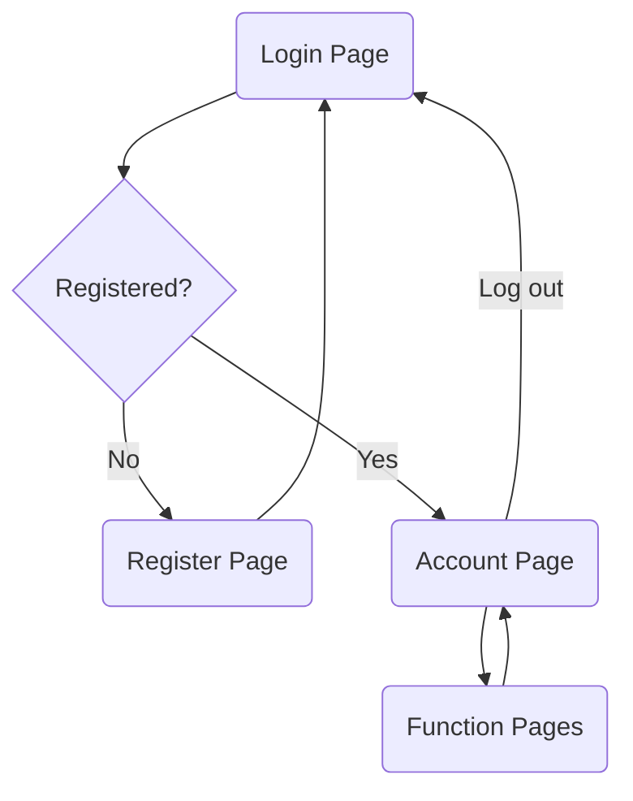
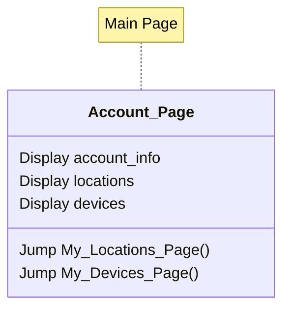
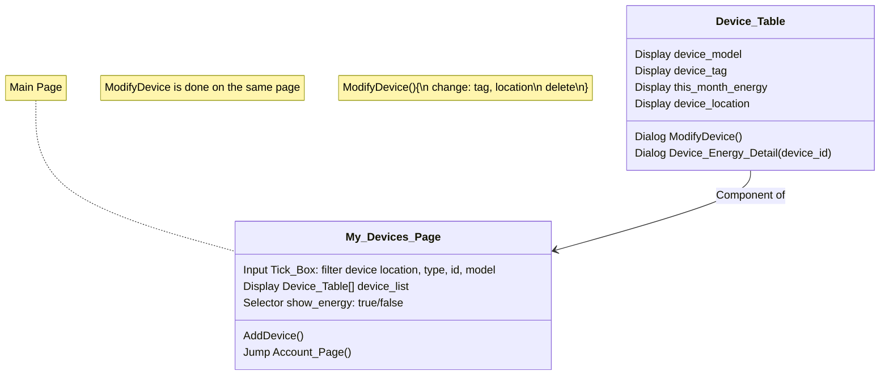
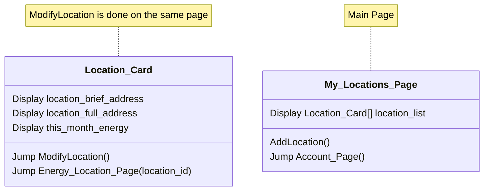
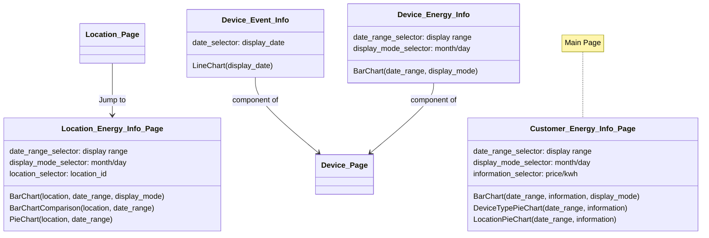

# 1 Introduction

&nbsp;&nbsp;&nbsp;&nbsp;In this project, we will need to design a web-based Smart Home Energy Management System. The project consists of two parts: database design and system implementation. In this part, we will describe a comprehensive database design. The organization of this part is as follows: In [Section 2](#2-schema-design), we will conduct a needs analysis for the project, followed by table design, as well as assumptions and justifications for the design. [Section 3](#3-database-creation) introduces the detailed creation of the database schema, specifying each table's columns, data types, and constraints. Finally, we will include some testing samples of the schema in [Section 4](#4-sql). 

# 2 Schema Design

## 2.1 Need Analysis
Based on the problem description, the information and functionalities needed can be concluded as follows:  
- User System:
  - Sign up: Name, billing address, email
  - One user <- many locations
- Location: 
    - Able to modify locations
    - Attributes:
      - Full address, including unit number
      - Start date
      - Square feet
      - Num bedrooms
      - Number of occupants of the unit
      - List of registered devices
- Devices
  - Type: AC, fridge, ...
  - Model: Samsung AC R100, ...
  - Ownership: User, Locations. (Can have more than one same model in a location by a user)
  - Can have an ID
- Devices Events(Signal / Information)
  - Switching On / Off (Time)
  - Setting Changed (Time, setting[possibly]). e.g. AC temperature, light bulb brightness, fridge door opened / closed, ...
  - Energy consumption
    - info / 5min: energy use
    - switched off: energy use since last update
 - Event format
   - Device ID
   - time stamp
   - label (e.g. energy_consumption, temperature_lowered, door_opened, ...)
   - number (corresponding to label)
- Energy Price
  - Vary according to: 
    - Hour
    - Zip Code

## 2.2 Entity-Relation Design
Based on the need analysis, the Entity-Relation Graph can be drawn:  


## 2.3 Assumptions and Justifications
The ER-Gram is calculated based on some assumptions, some of which will actually affect the schema. Below is an description of all the assumptions made:  

### 2.3.1 User & Location
Assumptions:  
1. Each user can only have one billing address. So billing_address could be an attribute in user table.  
2. Each home location can only belong to one account, so customer_id & start_date should be an attribute in address table.  
3. We assume the location format as the following: (Line 1)street_number street_name (Line 2)unit_number (zip code info)city, state zipcode. Based on the atomic principals, addresses are separated into different columns (e.g. street_num, street_name, ...).  
4. We also asuume the input addresses are all legal(they really exist, and in the right format). 

### 2.3.2 Device & Event
Assumptions:  
1. All the device models are in the list of device_model table, whenever a new device is promoted, we can modify the database to put it into the table.   
2. User can only register devices of which the models are in the device_model table. So there won't be any records in the *device_registered* table with ambiguous model_id.  
3. There are only limited number of event_label, and every the event_label revceived by the system should be legal.  
4. As mentioned in the problem desciption, we don't have to model how the system prestored all the event_labels. So we assume that the events are automatically stored into the database(such process is not modeled). In the project, this process might be simulated by manaully insert data into the model_event table.  
5. We assume that devices could generate two (or more) events at the same timeframe. However, such events will not have a same event_label. For example, when an AC is turened off, it generates two events: 'Off' and 'EnergyReport' with a same timeframe. Consequently, (device_id, event_label, event_datetime) is a candidate key of the *device_event* table.  

### 2.3.3 Energy Price & Calculation
Assumptions:
1. The unit of energy price is *dollars / kwh*. The unit of the energy consumption reported by devices is *kwh*.  
2. Because the energy price might vary between two consecutive hours, there might be situations where one EnergyReport has a time span across tow hours(e.g. first 2 minites in 7 and the other 3 minutes in 8). In this case, we choose the unit price of the second hour for calculation, resulting in an approximate energy price, which would not have significant difference with the actual price, given that the numbers of kwh used by home devices per 5 minutes are very small, and that the unit price of energy would not vary a lot.  


## 2.4 Tables Design
###  2.4.1 User & Location Table

customer: (**customer_id**, first_name, last_name, email, billing_street_num, billing_street_name, billing_unit_number, billing_city, billing_state, billing_zipcode, cpassword, in_use)  
location: (**location_id**, customer_id, location_street_num, location_street_name, location_unit_number, location_city, location_state, location_zipcode, square_feet, num_bedrooms, start_date, num_occupants, in_use)  

###  2.4.2 Device & Event
device_model(**model_id**, model_type, model_name), *This is for prestoring devices for user to register*  
device_registered(**device_id**, model_id, location_id, tag, in_use), *This is for devices registered by user*  
device_event(**device_id**, **event_label**, **event_datetime**, event_number), *event_number corresponds to event_label*  

###  2.4.3 Energy Price
energy_price(**zipcode**, **hour_of_day**, price), *Energy prices vary on hourly and locational basis*   

### 2.4.4 Modifications from the design of part1*
The last part of the project designed some foreign key constraints for table *device_event* and *device_registered*, but did not specify the on delete action for them. Taking into account of the large amount of data in these table that is associated with *device_register* and *location*, and the logic that if any devices and locations are deleted, the records of the corresponding energy consumption should be reserved (in order to show the correct energy statistic charts), 'in_use' attributes are added into these table. When some locations or devices are deleted, 'in_use' column are set to false, thus preserving the integrity constraints.

# 3 Database Creation
*In this part, we choose MySQL to implement the schema.*  

## 3.1 customer  
```sql
CREATE TABLE customer(
    customer_id INT AUTO_INCREMENT,
    first_name VARCHAR(63) NOT NULL,
    last_name VARCHAR(63) NOT NULL,
    email VARCHAR(255) UNIQUE NOT NULL,
    billing_street_num INT NOT NULL,
    billing_street_name VARCHAR(127) NOT NULL,
    billing_unit_number VARCHAR(127) NOT NULL,
    billing_city VARCHAR(127) NOT NULL,
    billing_state VARCHAR(16) NOT NULL, 
    billing_zipcode VARCHAR(5) NOT NULL,
    cpassword VARCHAR(127) NOT NULL,
    in_use BOOLEAN NOT NULL DEFAULT TRUE,
    PRIMARY KEY (customer_id)
);
```
## 3.2 location  
```sql
CREATE TABLE location(
    location_id INT AUTO_INCREMENT,
    customer_id INT NOT NULL,
    location_street_num INT NOT NULL,
    location_street_name VARCHAR(127) NOT NULL,
    location_unit_number VARCHAR(127) NOT NULL,
    location_city VARCHAR(127) NOT NULL,
    location_state VARCHAR(127) NOT NULL,
    location_zipcode VARCHAR(5) NOT NULL,
    square_feet FLOAT NOT NULL,
    num_bedrooms INT NOT NULL,
    num_occupants INT NOT NULL,
    start_date DATETIME NOT NULL,
    in_use BOOLEAN NOT NULL DEFAULT TRUE,
    PRIMARY KEY (location_id),
    FOREIGN KEY (customer_id) REFERENCES customer(customer_id) ON DELETE CASCADE
);
```
## 3.3 device_model  
```sql
CREATE TABLE device_model(
    model_id INT AUTO_INCREMENT,
    model_type VARCHAR(127) NOT NULL,
    model_name VARCHAR(127) NOT NULL,
    PRIMARY KEY (model_id)
);
```
## 3.4 device_registered  
```sql
CREATE TABLE device_registered(
    device_id INT AUTO_INCREMENT,
    model_id INT NOT NULL,
    location_id INT NOT NULL,
    tag VARCHAR(255),
    in_use BOOLEAN DEFAULT TRUE,
    PRIMARY KEY (device_id),
    FOREIGN KEY (model_id) REFERENCES device_model(model_id) ON DELETE CASCADE,
    FOREIGN KEY (location_id) REFERENCES location(location_id) ON DELETE CASCADE
);
```
## 3.5 device_event  
```sql
CREATE TABLE device_event(
    device_id INT NOT NULL,
    event_datetime DATETIME DEFAULT CURRENT_TIMESTAMP,
    event_label VARCHAR(63) NOT NULL,
    event_number FLOAT,
    PRIMARY KEY (device_id, event_datetime, event_label),
    FOREIGN KEY (device_id) REFERENCES device_registered(device_id) ON DELETE CASCADE
);
```
## 3.6 energy_price(**zipcode**, **hour_of_day**, price)  
```sql
CREATE TABLE energy_price(
    zipcode VARCHAR(5),
    hour_of_day INT NOT NULL,
    price FLOAT NOT NULL,
    PRIMARY KEY (zipcode, hour_of_day)
);
```

# Basic Pages and Functions Design
&nbsp;&nbsp;&nbsp;&nbsp;All the pages, excluding the login and register page, will require login. The server should detect if the user have logged in to the system, if not, they should be redirected to login page.  


## Account


&nbsp;&nbsp;&nbsp;&nbsp;Account page should display the basic information of the customer: account information(name, email, billing address, etc.), list of locations(short address for each location), list of devices(device model and type for each device). This page will also provide the buttons navigating to other pages as well.  

## Devices


&nbsp;&nbsp;&nbsp;&nbsp;Device page should show a table listing all the registered devices belonging to the account. For each device, the table entry is designed to show all the information of the deivce(model, tag). The energy overview of each device should also be shown in the entry. To provide more intuitive interactions, a selector defining what the table is showing(device info / energy) should be provided in this page.  

## Locations


&nbsp;&nbsp;&nbsp;&nbsp;Location page is designed to display a list of location cards, each showing the information of one location, including location address, detailed information, and buttons linking to the modification dialog and location energy page, which will be shown later.   

## EnergyInfo


&nbsp;&nbsp;&nbsp;&nbsp;There would be three components/pages of energy information, corresponding to the field of account, device, location. Account information page would show the overview of all the energy usage of all locations registered by the customer. It should also provide date range selector, display mode, etc. to facilitate various choices of view for the energy/fee consumption. Location energy page is designed similarly, adding an extra barchart comparing the energy information between current location and other locations with a close number of square feet. It also should provide vairous selection of displayed view. Device Event and Energy are set to be components of the device information page. Triggered by the buttons of the entry in device table, they would show the energy consumption on daily/monthly basis, and the event(Turned on/off, door opened/closed, etc.) genreated by the device.
